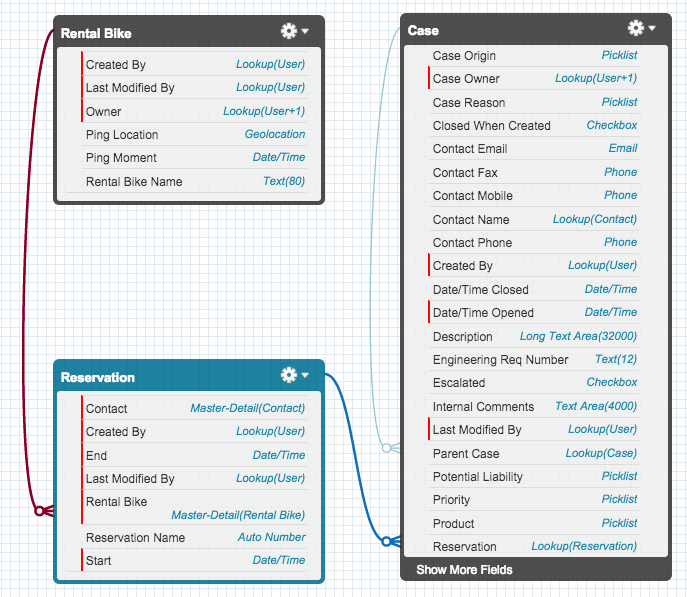
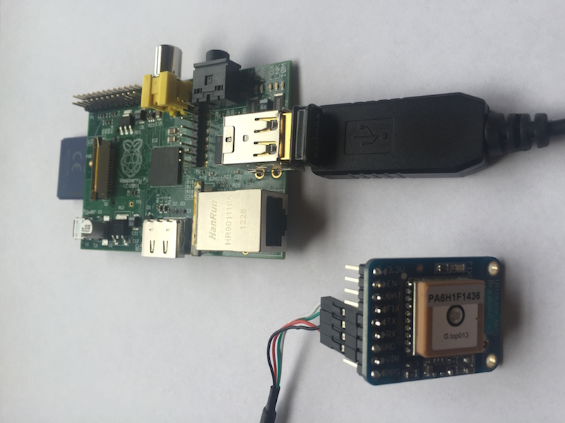

Building Multi-Sensory Apps that Connect IoT to Business Processes
==================================================================

The Internet of Things opens a new world of experiences and deep connectivity for both consumers and businesses.  Always-on sensor streams, big data, and machine learning are dramatically changing the kinds of experiences software developers are building.  These changes require those of us who build software to think differently about what software is and how it is composed.  Software is no longer simple database-centric, CRUD interfaces.  [Multi-Sensory Applications](https://multisensory.github.io/) are systems which connect all the things: IoT, business processes, data analytics, and immerse user experiences.

Before we dive into a very simple MSA that connects IoT data to a back-office business process, go read about the [Principals of Multi-Sensory Applications](https://multisensory.github.io/) so that you understand the basic ideas.

Ok, now lets walk through an MSA that uses location sensor data and wraps a business process around that data.  We will start with the basics and add additional senses and transducers in future blog posts.  This example focuses on a rental bike business that needs to address a problem with bikes periodically going missing.  Here is the business process:

* A customer rents a bike and GPS tracking is enabled
* Throughout the rental, the bike transmits it current location to the cloud
* If no information about the bike's location has been received for 30 minutes, a support case including the last known location of the bike is created
* An employee can then go investigate the disappearance

Before we go into the technical architecture, here is a short video demonstrating this MSA:

*** TODO: Video ***

The senses and transducers needed to build this MSA are:

* Identity Senses: Bike shop associate
* Device Input Sense: Bike GPS location
* User Input Senses: Rental begins & ends
 
* Storage Transducers: Rental bikes, reservations, & support cases
* Integration Transducer: Associate bike location with rental bike & reservation
* Analysis Transducer: Creates support cases for lost bikes
* Notification Transducer: Emails bike shop associate when a support case is created

Breaking this down into individual components and microservices:

* Back-office services & data on Salesforce:
    * Bike shop associate identity
    * Rental business data (inventory, reservations, & support cases)
    * Periodic lost bike checker

* Rental bike tracker:
    * Raspberry Pi with GPS
    * Network connectivity

* Location data ingest microservice:
    * Web endpoint on Heroku
    * Connected to Salesforce via REST APIs

Putting it all together here is what happens:

1. A bike shop associate creates a reservation record in Salesforce
1. When a rental begins the Raspberry Pi feeds it's location every minute to the ingest microservice
1. The ingest microservice on Heroku updates the latest location on the reservation in Salesforce
1. A schedule job on Salesforce periodically checks for active reservations which have not received location data in the past 30 minutes
1. A support cases is created for the lost bikes and assigned to a bike shop associate

Lets walk through [the code](https://github.com/multisensory/bike-tracks) to put this all together.

On Salesforce I created two new custom objects that hold the bike rental inventory and reservations.  I also added an association between a Case object and the rental bike reservation which allows support cases to be created and associated with a bike reservation.  The bike rental reservation has fields that hold the last known location.  Here is the full schema:



I also created a custom Visualforce page which renders a bike's last known location on Google Maps:

```
<apex:page standardController="Rental_Bike__c">
    
    <head>
        <style type="text/css">
          html { height: 100% }
          body { height: 100%; margin: 0; padding: 0 }
          #map-canvas { width:800px; height:400px; }
        </style>
        <script src="https://maps.googleapis.com/maps/api/js?sensor=false"></script>
        
        <script>
            var lat = {!Rental_Bike__c.Ping_Location__Latitude__s};
            var lon = {!Rental_Bike__c.Ping_Location__Longitude__s};
            function initialize() {
                var mapOptions = {
                    center: new google.maps.LatLng(lat, lon),
                    zoom: 15
                };
            
                var map = new google.maps.Map(document.getElementById("map-canvas"), mapOptions);
            
                var marker = new google.maps.Marker({
                        position: new google.maps.LatLng(lat, lon),
                        map: map,
                        title: '{!Rental_Bike__c.Name}'
                });
            }
            
            google.maps.event.addDomListener(window, 'load', initialize);
        </script>
    </head>
    
    <body>
      <div id="map-canvas"/>
    </body>
    
</apex:page>
```

Finally for the back-office side I created a schedulable Apex class that creates support cases for active bike rentals which have not had a new location update in the past 30 minutes:

```
global class CheckForMissingBikes implements Schedulable {

    global void execute(SchedulableContext SC) {
        List<Reservation__c> reservationsThatNeedCases = [
            SELECT Id, Contact__c
            FROM Reservation__c
            WHERE Id NOT IN (SELECT Reservation__c FROM Case) AND Id IN :reservationsWithMissingBikes()
        ];
        
        for (Reservation__c r : reservationsThatNeedCases) {
            Case c = new Case(
                Reservation__c = r.Id,
                ContactId = r.Contact__c,
                Subject = 'A Rental Bike is Missing!'
            );
            insert c;
        }
    }
    
    // Bikes with active reservations that have not received a ping for 30 minutes
    public static List<Reservation__c> reservationsWithMissingBikes() {
        DateTime timeSince = System.now().addMinutes(-30);
        
        // this does not include reservations that have been active for less than 30 minutes
        List<Reservation__c> reservationsWithMissingBikes = [
            SELECT Id, Rental_Bike__c
            FROM Reservation__c
            WHERE Start__c < :timeSince AND
                  End__c > :System.now() AND
                  (Rental_Bike__r.Ping_Moment__c < :timeSince OR Rental_Bike__r.Ping_Moment__c = NULL)
        ];
       
        return reservationsWithMissingBikes;
    }
    
}
```

For the microservice on Heroku I used Play Framework and Scala to create a web endpoint that takes a location ping and updates the rental bike's location on Salesforce.  Here is the controller code that handles the POST request:

```scala
def sendLoc = Action.async(parse.urlFormEncoded) { request =>
  Logger.info(request.body.toString())
  val bikeRentalId = request.body("bike_rental_id").head
  val geo = Geolocation(request.body("lat").head.toDouble, request.body("lon").head.toDouble)
  val dateTime = Try {
    DateTime.parse(request.body("time").head)
  } getOrElse {
    DateTime.now()
  }
  val ping = Ping(geo, dateTime)
  Salesforce(Play.current).updatePing(bikeRentalId, ping).map { r =>
    Logger.info(r.toString)
    Ok
  }
}
```

Finally there is a small Python app that runs on the Raspberry Pi and feeds the data to the microservice on Heroku:

```python
import gps
import httplib, urllib
import time
import threading
import socket
 
class GpsPoller(threading.Thread):

  def __init__(self):
    threading.Thread.__init__(self)
    self.gpsd = gps.gps(mode=gps.WATCH_ENABLE)
    self.current_value = self.gpsd.next()

  def get_current_value(self):
    return self.current_value

  def run(self):
    while True:
      self.current_value = self.gpsd.next()

if __name__ == "__main__":
  try:
    gpsp = GpsPoller()
    gpsp.daemon = True
    gpsp.start()
    while True:
      cur = gpsp.get_current_value() 
      if cur["class"] == "TPV":
        if hasattr(cur, "lat"):
          data = {"bike_rental_id": "a00j00000041nvH", "lat": cur.lat, "lon": cur.lon, "time": cur.time}
          headers = {"Content-type": "application/x-www-form-urlencoded"}
          try:
            conn = httplib.HTTPConnection("foo.herokuapp.com")
            conn.request("POST", "/", urllib.urlencode(data), headers)
            conn.close()
            print data
          except (httplib.HTTPException, socket.error) as ex:
            print ex
      time.sleep(60) # once per minute

  except KeyboardInterrupt:
    quit()
```

The Python script has a hard-coded ID for the rental bike and a hard-coded HTTP endpoint.  Using one of the many IoT gateway products out there, this could be designed differently but I chose to keep things simple for this example.

Here is what the Raspberry Pi hardware looks like:



I used the [Adafruit Ultimate GPS Breakout](https://www.adafruit.com/product/746) via USB, following [the Adafruit instructions](https://learn.adafruit.com/adafruit-ultimate-gps-on-the-raspberry-pi/introduction) to setup everything.  For networking I used an Edimax USB wifi adapter.  If I were building this for the real world I would have used a GPRS modem with a prepaid SIM card.

That's it for the code!  You can build and deploy all of this stuff on your own!  [Check out the deployment instructions](https://github.com/multisensory/bike-tracks/blob/master/README.md).


*** TODO: Going Further ***

 
In future blogs I will expand on this simple example and add the ability to do big data analysis on the anonymous location data to determine the most popular routes.
